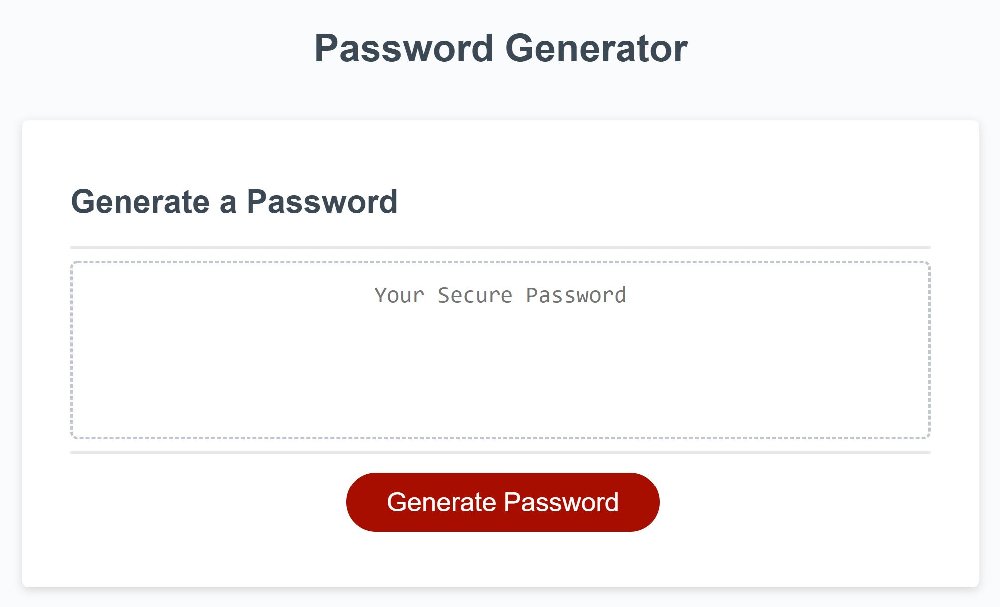

# Password Generator Challenge

## Purpose
Used to generate a random password between eight and 128 characters in length, including user's choice of lower case, upper case, numbers, and special characters. There will be at least one of each of the user's choice of character.

## Website
The actual website can be viewed at the [following link](https://aelisker.github.io/password-gen/). The code repository can be found at [here](https://github.com/aelisker/password-gen/).

You can also find a screenshot of the website below:

## Model
This was modeled off starter code found [here].(https://github.com/coding-boot-camp/friendly-parakeet)